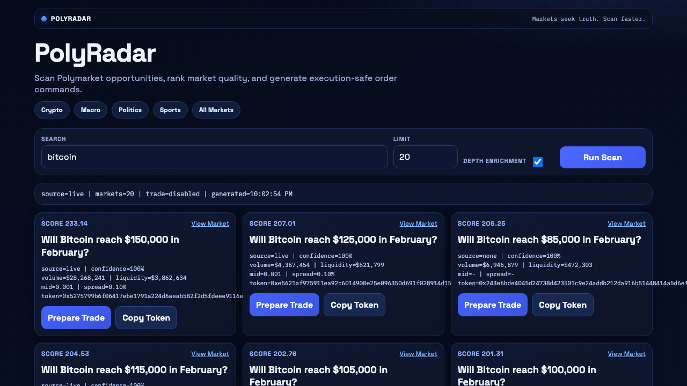

# PolyRadar

Local scanner + trade-prep UI built on top of [`polymarket-cli`](https://github.com/Polymarket/polymarket-cli).



## Quick start

```bash
cd /Users/fred/GPT-CODE/polyradar
cp .env.example .env
npm install
npm start
```

Open: `http://127.0.0.1:8790`

## Why

Polymarket has many fast-moving markets. PolyRadar helps you:

- find high-activity markets quickly
- compare quality (volume/liquidity/spread) in one place
- move from discovery to safe trade prep without raw CLI juggling

## What it does

- scans/ranks markets from `polymarket markets list/search`
- enriches with CLOB midpoint/spread (best effort)
- provides trade prep flow: simulate -> risk checks -> optional execute

## Config

`.env`:

- `PORT` default `8790`
- `POLYMARKET_BIN` default `polymarket`
- `ENABLE_TRADING` default `false`
- `POLYRADAR_MOCK_IF_UNAVAILABLE` default `true`
- `POLYRADAR_DEFAULT_LIMIT` default `20`
- `POLYRADAR_MAX_ENRICH` default `8`

## API

- `GET /api/health`
- `GET /api/config`
- `GET /api/scan?search=bitcoin&limit=20&enrich=true`
- `POST /api/trade/simulate`
- `POST /api/trade/execute` (only when `ENABLE_TRADING=true`)

## Safety

Execution is off by default. Keep `ENABLE_TRADING=false` unless you explicitly want live orders.
